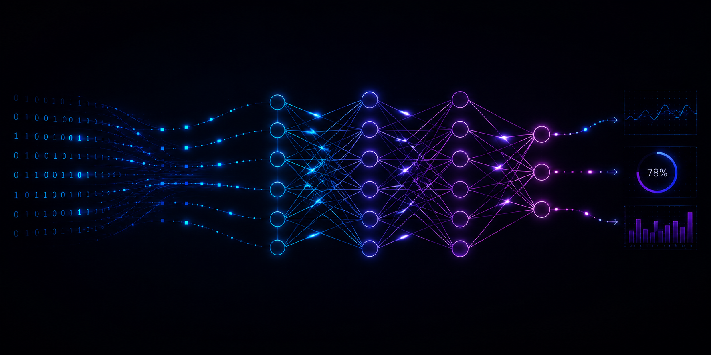

  

<h1 align="center">Hi there! 👋 I'm Abhishek Sahu</h1>

🎓 <b>B.Tech Computer Science Undergraduate</b> 
📍 Birla Institute of Technology, Mesra

I am interested in <b>Artificial Intelligence</b>, particularly <b>Large Language Models</b>, <b>Deep Learning</b>, and the mathematics behind foundations the modern AI systems.

I enjoy exploring the architectures, algorithms, and principles that make them work. My strong interest in mathematics motivates me to understand AI from first principles while building practical implementations and contributing to open-source projects.

---

## 🔬 Research Interests

<table>
<tr>

<td width="100%" valign="top">

### 🧠 LLM Research

- Transformer Architectures
- Retrieval-Augmented Generation (RAG)
- Efficient Model Adaptation (PEFT, LoRA)

</td>
</tr>

<tr>
<td width="50%" valign="top">

### 📐 Foundations

- Mathematics for Machine Learning
- AI Systems

</td>
</tr>
</table>

---

## 🛠️ Tech Stack

### Programming Languages

  

### AI & Machine Learning

  
  

### Development & Tools

  

---

## 🌐 Connect With Me

  

  

